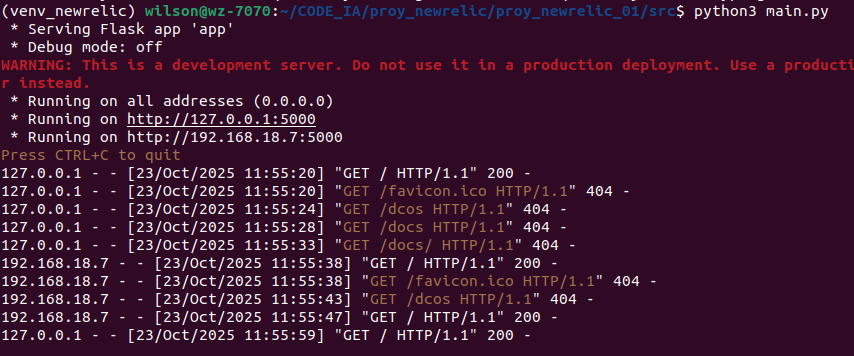
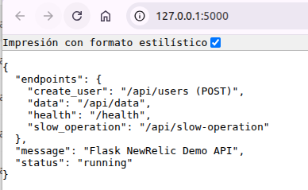

# Proyecto de conexion con New Relic - 01
    Probando conexion con python 3.11

## Crear entorno virtual
  python3.11 -m venv env_proyecto

## Instalación
1. Clona el repositorio
2. Instala dependencias: `pip install -r requirements.txt`
3. Configura tu API key en `.env`
4. Ejecuta: `python src/main.py`

## -- Clear cache python
  ```bash
  $ find . | grep -E "(__pycache__|\.pyc|\.pyo$)" | xargs rm -rf
  ```

# Proyecto usando Flask
  1. Estructura de carpetas
  ```bash
  src/
  ├── main.py
  ├── Dockerfile
  ├── requirements.txt
  ├── .env.example
  ├── app/
  │   ├── __init__.py
  │   ├── config/
  │   │   ├── __init__.py
  │   │   └── config.py
  │   ├── controllers/
  │   │   ├── __init__.py
  │   │   └── api_controller.py
  │   ├── models/
  │   │   ├── __init__.py
  │   │   └── database.py
  │   ├── services/
  │   │   ├── __init__.py
  │   │   └── api_service.py
  │   └── utils/
  │       ├── __init__.py
  │       └── logger.py
  └── tests/
      ├── __init__.py
      └── test_api.py
  ```

  2. Resultados:
    

  3. En el navegador:
    
